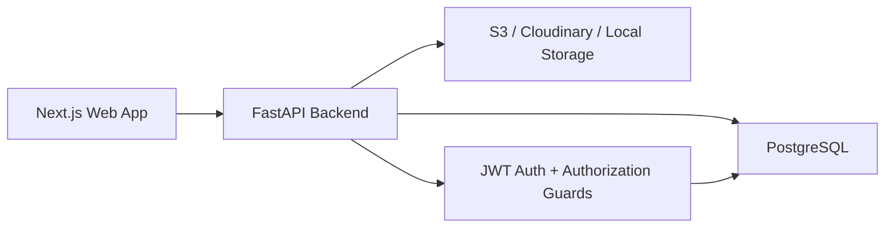

# Architecture

## Product Shape

This is a secure family healthcare management platform with one centralized database and four user accounts:

- Mom
- Dad
- Me
- Sister

The application separates users into authorization groups:

- `parents`: Mom and Dad
- `siblings`: Me and Sister

Every user can fully manage their own records. Users can read records for users in their authorization group. Cross-group access is denied at the API layer before protected database queries are executed.

## Recommended Tech Stack

### Frontend

Next.js with TypeScript is the best fit because it gives us:

- protected route groups
- server-side session checks when useful
- production-quality deployment on Vercel
- strong support for TailwindCSS and shadcn/ui
- good ergonomics for dashboard pages, upload modals, and charts

### Backend

FastAPI is a strong backend choice for this healthcare-style app because it gives us:

- typed request and response validation with Pydantic
- automatic OpenAPI documentation
- clean dependency injection for auth and authorization guards
- async-ready APIs
- mature SQLAlchemy support for PostgreSQL

### Database

PostgreSQL is the system of record. It stores users, family authorization groups, medical records, doctors, medications, appointments, files, audit events, and health measurements.

### File Storage

Development can use local file storage. Production should use S3-compatible storage, Cloudinary, or Firebase Storage. The database stores file metadata and the storage object key, not the raw file bytes.

## System Diagram



## Authorization Model

The key production rule is dataset-level authorization. Roles alone are not enough because all four users may have the same role, but their data visibility differs.

Authorization uses:

- `users`: individual login accounts
- `family_groups`: logical sharing groups, such as parents and siblings
- `family_group_members`: membership table
- ownership columns such as `patient_user_id`

Access rules:

- Write access: only the owner of a dataset can create, update, or delete their own patient data.
- Read access: the owner or a user in the same family group can view the data.
- Cross-group reads and writes are denied.

All backend APIs should call an authorization helper before querying record details.

## Backend Modules

```text
apps/api/app
|-- core          # config, security, JWT, CORS
|-- db            # database session and migrations integration
|-- models        # SQLAlchemy models
|-- schemas       # Pydantic request/response models
|-- services      # business logic and authorization checks
|-- api           # route modules
`-- main.py       # FastAPI app factory
```

## Frontend Modules

```text
apps/web
|-- app
|   |-- login
|   |-- dashboard
|   |-- records
|   |-- medications
|   |-- doctors
|   |-- analytics
|   `-- profile
|-- components
|-- lib
`-- types
```

## Security Decisions

- Passwords are hashed with bcrypt.
- JWTs are signed with a backend-only secret.
- APIs validate input with Pydantic.
- SQLAlchemy parameterization prevents SQL injection.
- CORS is configured through environment variables.
- Uploads are validated by MIME type, size, and ownership.
- File downloads go through authorized backend routes or short-lived signed URLs.
- Audit events are stored for sensitive actions.

## Deployment Plan

Recommended production deployment:

- Frontend: Vercel
- Backend: Render, Fly.io, Railway, or AWS App Runner
- Database: managed PostgreSQL
- File storage: S3-compatible bucket or Cloudinary
- Secrets: platform-managed environment variables

The frontend calls the deployed API URL. The backend connects to PostgreSQL and file storage using private environment variables.

